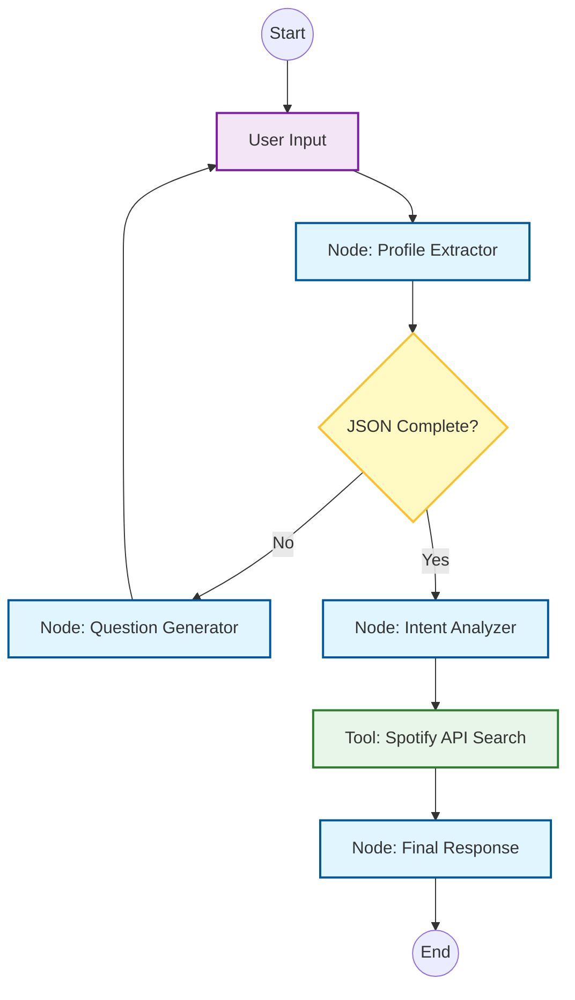

# Sonic Bridge Agent 🎵

> A conversational recommendation system that bridges user profiles with their perfect soundtrack.

**Sonic Bridge** is a Proof of Concept (PoC) for an Agentic Recommendation System. It leverages **LangGraph** to manage conversational state and **LangChain** to extract structured data from natural language. The agent builds a demographic profile of the user before analyzing their musical intent and querying the **Spotify API** for personalized recommendations.

## 🎯 Objective

This project demonstrates the implementation of a stateful AI agent that:
1.  **Profiles:** Extracts specific entities (`name`, `age`, `gender`) from conversation into a structured JSON format.
2.  **Validates:** Uses a "Human-in-the-loop" workflow to ask follow-up questions if the profile is incomplete.
3.  **Analyzes:** Interprets user intent (mood, genre, activity) to translate natural language into API parameters.
4.  **Recommends:** Fetches real-time data from Spotify to generate curated lists.

## 🏗 Architecture

The system is modeled as a state machine using **LangGraph**. It enforces a strict flow where recommendations are only generated after the user profile is fully established.



### Flow Breakdown

1. **Profile Extractor:** Analyzes user input to populate the required JSON schema (`name`, `age`, `gender`).
2. **Question Generator (Loop):** If data is missing (e.g., user didn't state their age), this node generates a context-aware question and loops back to the user.
3. **Intent Analyzer:** Once the profile is complete, this node translates the user's request (e.g., "music for studying") into technical query parameters (valence, acousticness, genre).
4. **Spotify Tool:** Executes the search against the Spotify Web API.
5. **Final Response:** Formats the API results into a friendly, personalized message.

## 🚀 Key Features

* **Structured Output:** Enforces a specific JSON schema for user profiling.
* **State Management:** Persists conversation history and extracted entities across turns.
* **Real-time Data:** Integration with `Spotipy` to fetch real tracks and audio features.
* **Modular Nodes:** Separation of concerns between profiling, intent analysis, and response formatting.

## 🛠 Tech Stack

* **Language:** Python 3.10+
* **Orchestration:** [LangGraph](https://langchain-ai.github.io/langgraph/) & [LangChain](https://www.langchain.com/)
* **LLM:** OpenAI GPT-3.5/4 (Configurable)
* **External API:** Spotify Web API (via `spotipy`)
* **Validation:** Pydantic

## 📦 Installation

1. **Clone the repository**
```bash
git clone [https://github.com/your-username/sonic-bridge-agent.git](https://github.com/your-username/sonic-bridge-agent.git)
cd sonic-bridge-agent

```


2. **Set up the Virtual Environment**
```bash
python -m venv venv
source venv/bin/activate  # On Windows: venv\Scripts\activate

```


3. **Install Dependencies**
```bash
pip install -r requirements.txt

```


4. **Environment Variables**
Create a `.env` file in the root directory:
```env
OPENAI_API_KEY="sk-..."
SPOTIPY_CLIENT_ID="your_spotify_id"
SPOTIPY_CLIENT_SECRET="your_spotify_secret"

```


## ⚡ Usage Example

```text
User: "Hi, I'm Ana."
Agent: "Hello Ana! To give you the best music recommendations, could you tell me your age?"
User: "I'm 22."
Agent: [System: Profile Complete] "Got it. What kind of vibe are you looking for today?"
User: "I need something to focus on my coding project."
Agent: "Understood. Searching for 'Focus' and 'Lo-Fi' tracks with high acousticness... Here are 5 songs perfect for deep work."

```

## 📝 License

This project is licensed under the MIT License.

```
