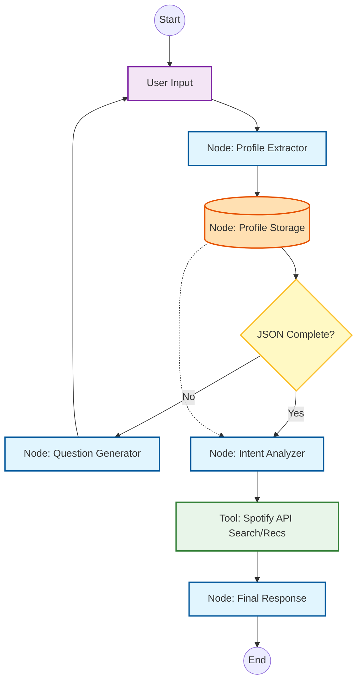

# Sonic Bridge Agent 🎵

> A conversational recommendation system that bridges user profiles with their perfect soundtrack.

**Sonic Bridge** is a Proof of Concept (PoC) for an Agentic Recommendation System. It leverages **LangGraph** to manage conversational state and **LangChain** to extract and persist structured data from natural language.

## 🎯 Objective

This project demonstrates a stateful AI agent that:

1. **Profiles:** Extracts specific entities (`name`, `age`, `gender`) from conversation.
2. **Persists:** Stores extracted data in a temporary state database to ensure session durability.
3. **Validates:** Uses a "Human-in-the-loop" workflow for missing profile data.
4. **Analyzes:** Translates natural language intent into technical Spotify API parameters.

## 🏗 Architecture

The system uses a state machine where the **Profile Storage** acts as the single source of truth.

### Flow Breakdown

1. **Profile Extractor:** Populates the required JSON schema (`name`, `age`, `gender`).
2. **Profile Storage:** Persists the JSON state (SQLite/Redis). This ensures the agent doesn't "forget" information during the loop.
3. **Question Generator (Loop):** Generates context-aware questions for missing data.
4. **Intent Analyzer:** Reads the consolidated profile and maps user "vibes" to Spotify parameters (e.g., `valence`, `energy`).
5. **Spotify Tool:** Queries the API using the translated technical parameters.

## 🛠 Tech Stack

* **Orchestration:** LangGraph & LangChain
* **External API:** Spotify Web API (via `spotipy`)
* **Persistence:** SQLite / Local State JSON (for session management)
* **Validation:** Pydantic
